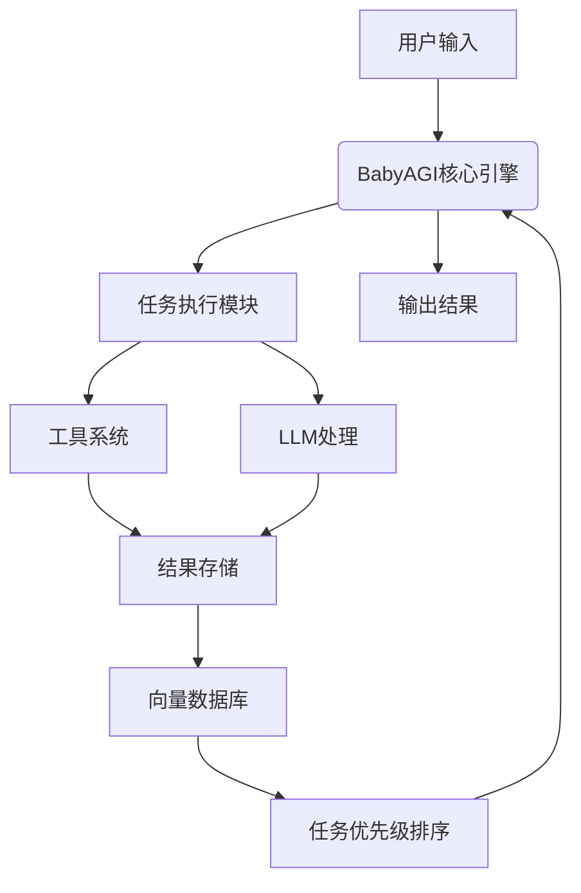
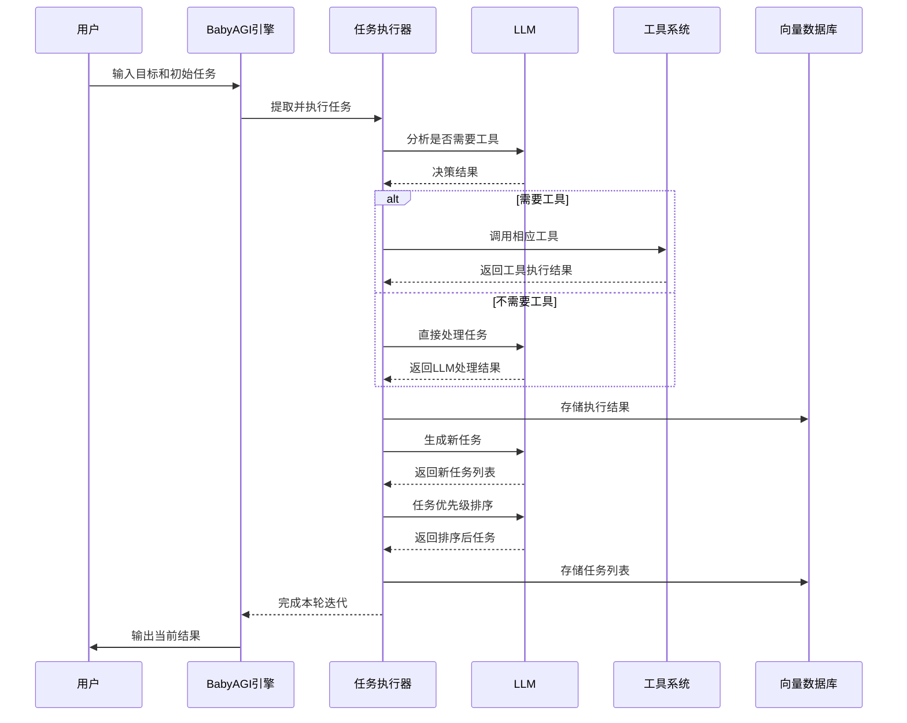

# BabyAGI Agent 系统

基于 BabyAGI 框架开发的智能 Agent 系统，具备任务规划、执行和结果管理功能。

## 🚀 快速开始

### 1. 安装依赖
```bash
pip install -r requirements.txt
```

### 2. 配置环境
```bash
# 复制环境配置文件
cp .env.example .env

# 编辑配置文件，设置必要的参数
vim .env
```

### 3. 启动系统
```bash
# 方式一：使用启动脚本
python run.py

# 方式二：直接运行 Flask 应用
python app.py
```

### 4. 访问 Web 界面
打开浏览器访问：http://localhost:5000

## 📋 功能特性

- ✅ **智能任务规划**：基于 BabyAGI 的任务分解和优先级排序
- ✅ **工具集成**：支持命令执行、文件操作、网络搜索等工具
- ✅ **Web 界面**：现代化的用户界面，支持 Agent 管理和任务监控
- ✅ **RESTful API**：完整的 API 接口，支持程序化调用
- ✅ **多 LLM 支持**：支持 OpenAI API 和本地 Ollama 模型
- ✅ **向量数据库**：使用 ChromaDB 进行上下文存储和检索
- ✅ **日志系统**：完整的日志记录和错误追踪

## 🏗️ 项目结构

```
p-llm-agent-babyagi/
├── app.py                 # Flask 应用主文件
├── run.py                 # 启动脚本
├── config.py              # 配置管理
├── logger.py              # 日志系统
├── custom_babyagi.py      # 自定义 BabyAGI 核心类
├── enhanced_babyagi.py    # 增强版 BabyAGI（集成工具系统）
├── tools.py               # 工具集成系统
├── requirements.txt       # Python 依赖
├── .env.example          # 环境配置示例
├── templates/            # HTML 模板
│   └── index.html
└── static/               # 静态文件
    ├── css/
    │   └── style.css
    └── js/
        └── app.js
```

## 🔧 配置说明

### 环境变量配置

在 `.env` 文件中配置以下参数：

```bash
# LLM 配置
LLM_PROVIDER=openai          # openai 或 ollama
OPENAI_API_KEY=your_key_here
OLLAMA_BASE_URL=http://localhost:11434
LLM_MODEL=gpt-3.5-turbo

# 向量数据库配置
VECTOR_DB_TYPE=chromadb
CHROMA_PERSIST_DIRECTORY=./chroma_db

# API 配置
API_HOST=0.0.0.0
API_PORT=5000
API_DEBUG=false

# 日志配置
LOG_LEVEL=INFO
LOG_FILE=logs/babyagi.log
```

## 📖 使用指南

### Web 界面使用

1. **快速执行任务**：在首页填写目标描述和初始任务，点击"立即执行"
2. **创建 Agent**：填写 Agent 名称、目标和初始任务，创建持久化 Agent
3. **管理 Agent**：查看、启动、停止和删除 Agent
4. **查看结果**：实时查看任务执行结果和系统统计

### API 接口使用

#### 创建 Agent
```bash
curl -X POST http://localhost:5000/api/agents \
  -H "Content-Type: application/json" \
  -d '{
    "name": "测试Agent",
    "objective": "完成数据分析任务",
    "initial_task": "收集用户数据"
  }'
```

#### 启动 Agent
```bash
curl -X POST http://localhost:5000/api/agents/{agent_id}/start
```

#### 获取结果
```bash
curl http://localhost:5000/api/agents/{agent_id}/results
```

## 🔄 核心流程

### 系统架构



### 时序图



## 🧠 核心逻辑说明

### BabyAGI 核心循环

BabyAGI 的核心是一个循环过程，包含任务执行、结果存储、新任务生成和任务优先级排序四个步骤：

```python
def run(self, initial_task=None):
    """运行 BabyAGI"""
    if initial_task is None:
        initial_task = f"Develop a task list to achieve: {self.objective}"
    
    # 运行核心逻辑
    task_list = [initial_task]
    
    for i in range(self.config.MAX_ITERATIONS):
        if not task_list:
            logger.info("Task list is empty. Stopping.")
            break
            
        task = task_list.pop(0)
        logger.info(f"Executing task: {task}")
        
        # 执行任务
        result = self.execute_task(task)
        logger.info(f"Task result: {result}")
        
        # 存储结果
        self.vector_db.add(
            documents=[result],
            metadatas=[{"task": task}],
            ids=[f"task_{i}"]
        )
        
        # 创建新任务
        new_tasks = self.create_tasks(task, result)
        task_list.extend(new_tasks)
        
        # 重新排序任务
        task_list = self.prioritize_tasks(task_list)
        
        logger.info(f"Updated task list: {task_list}")
    
    return self.vector_db.get()
```

### 任务执行逻辑

任务执行模块会判断是否需要调用工具来完成任务：

```python
def enhanced_execute_task(self, task):
    """增强的任务执行方法，支持工具调用"""
    # 分析任务是否需要工具
    tool_prompt = f"""
    分析以下任务是否需要使用工具执行，如果需要，返回JSON格式的工具调用说明：
    任务: {task}
    
    可用工具:
    - execute_command: 执行命令行命令，参数: {{"cmd": "命令"}}
    - web_search: 执行网络搜索，参数: {{"query": "搜索查询"}}
    - read_file: 读取文件，参数: {{"filepath": "文件路径"}}
    - write_file: 写入文件，参数: {{"filepath": "文件路径", "content": "内容"}}
    
    如果不需要工具，直接使用LLM思考并回答。
    返回格式: {{"use_tool": true/false, "tool_name": "工具名", "tool_params": {{}}, "reasoning": "思考过程"}}
    """
    
    # 获取工具调用决策
    decision = json.loads(self.llm(tool_prompt))
    
    if decision["use_tool"]:
        # 执行工具调用
        tool_name = decision["tool_name"]
        tool_params = decision["tool_params"]
        
        if tool_name in TOOL_REGISTRY:
            tool_func = TOOL_REGISTRY[tool_name]
            result = tool_func(**tool_params)
            return f"工具 {tool_name} 执行结果: {result}"
        else:
            return f"错误: 未知工具 {tool_name}"
    else:
        # 使用LLM直接处理任务
        return self.llm(f"请完成以下任务: {task}")
```

### 工具系统

系统提供多种工具供任务执行时调用：

```python
class ToolKit:
    @staticmethod
    def execute_command(cmd):
        """执行命令行命令"""
        try:
            result = subprocess.run(cmd, shell=True, capture_output=True, text=True)
            return result.stdout if result.returncode == 0 else result.stderr
        except Exception as e:
            return f"Error executing command: {str(e)}"
    
    @staticmethod
    def web_search(query):
        """执行网络搜索（示例）"""
        # 这里可以集成 SerperAPI、SerpAPI 或其他搜索API
        return f"Web search results for: {query}"
    
    @staticmethod
    def read_file(filepath):
        """读取文件内容"""
        try:
            with open(filepath, 'r') as f:
                return f.read()
        except Exception as e:
            return f"Error reading file: {str(e)}"
    
    @staticmethod
    def write_file(filepath, content):
        """写入文件内容"""
        try:
            with open(filepath, 'w') as f:
                f.write(content)
            return f"Successfully wrote to {filepath}"
        except Exception as e:
            return f"Error writing file: {str(e)}"

# 工具注册表
TOOL_REGISTRY = {
    "execute_command": ToolKit.execute_command,
    "web_search": ToolKit.web_search,
    "read_file": ToolKit.read_file,
    "write_file": ToolKit.write_file
}
```

## 🛠️ 开发指南

### 添加自定义工具

在 `tools.py` 中添加新的工具类：

```python
class CustomTool(BaseTool):
    def __init__(self):
        super().__init__("custom_tool", "自定义工具描述")
    
    def execute(self, **kwargs):
        # 实现工具逻辑
        return {"success": True, "result": "执行结果"}

# 注册工具
tool_registry.register(CustomTool())
```

### 扩展 BabyAGI 功能

继承 `EnhancedBabyAGI` 类来添加新功能：

```python
class MyBabyAGI(EnhancedBabyAGI):
    def custom_task_processing(self, task):
        # 自定义任务处理逻辑
        pass
```

## 🐳 Docker 部署

```bash
# 构建镜像
docker build -t babyagi-agent .

# 运行容器
docker run -p 5000:5000 -v $(pwd)/.env:/app/.env babyagi-agent
```

## 📝 技术方案详细说明

基于 BabyAGI 框架开发自主 Agent 是一个系统性的工程，下面提供详细的实施方案与步骤：

## 一、项目规划与设计阶段

### 1.1 确定 Agent 的目标和范围
- **明确功能定位**：确定 Agent 要解决的具体问题领域
- **定义成功指标**：设定可衡量的性能指标和评估标准
- **确定交互方式**：命令行、Web界面、API接口等

### 1.2 架构设计
```
BabyAGI-based Agent 架构：
┌─────────────────┐    ┌─────────────────┐    ┌─────────────────┐
│  任务输入系统    │ →  │   BabyAGI核心   │ →  │  结果输出系统    │
│ (用户/API/定时)  │    │ 任务处理引擎    │    │ (存储/通知/API)  │
└─────────────────┘    └─────────────────┘    └─────────────────┘
         ↓                      ↓                      ↓
┌─────────────────┐    ┌─────────────────┐    ┌─────────────────┐
│  知识库与上下文   │ ←  │   记忆与状态     │ →  │  工具与执行器    │
│  (向量数据库)    │    │   管理系统      │    │ (代码/API/CLI)   │
└─────────────────┘    └─────────────────┘    └─────────────────┘
```

### 1.3 技术栈选择
- **核心框架**：BabyAGI
- **LLM 集成**：OpenAI API 或本地模型（Ollama/Llama）
- **向量数据库**：ChromaDB/Pinecone/Weaviate
- **任务队列**：Celery/RQ（可选）
- **前端界面**：Gradio/Streamlit（可选）
- **部署方式**：Docker/Kubernetes

## 二、环境设置与基础配置

### 2.1 开发环境搭建
```bash
# 创建项目目录
mkdir my-babyagi-agent && cd my-babyagi-agent

# 创建虚拟环境
python -m venv .venv
source .venv/bin/activate  # Linux/Mac
# 或 .venv\Scripts\activate  # Windows

# 安装核心依赖
pip install babyagi chromadb openai tiktoken

# 安装可选依赖
pip install gradio streamlit celery redis
```

### 2.2 配置文件设置
创建 `config.py`：
```python
import os
from dotenv import load_dotenv

load_dotenv()

class Config:
    # LLM 配置
    LLM_PROVIDER = os.getenv("LLM_PROVIDER", "openai")  # openai, ollama, anthropic
    OPENAI_API_KEY = os.getenv("OPENAI_API_KEY")
    OPENAI_MODEL = os.getenv("OPENAI_MODEL", "gpt-3.5-turbo")
    
    # Ollama 配置
    OLLAMA_BASE_URL = os.getenv("OLLAMA_BASE_URL", "http://localhost:11434")
    OLLAMA_MODEL = os.getenv("OLLAMA_MODEL", "llama2")
    
    # 向量数据库配置
    VECTOR_DB = os.getenv("VECTOR_DB", "chroma")  # chroma, pinecone, weaviate
    CHROMA_PERSIST_DIR = os.getenv("CHROMA_PERSIST_DIR", "./chroma_db")
    
    # 任务配置
    MAX_ITERATIONS = int(os.getenv("MAX_ITERATIONS", 5))
    OBJECTIVE = os.getenv("OBJECTIVE", "Develop a task list")
    
    # 日志配置
    LOG_LEVEL = os.getenv("LOG_LEVEL", "INFO")
```

## 三、核心功能开发

### 3.1 自定义 BabyAGI 核心
创建 `custom_babyagi.py`：
```python
import logging
from babyagi import BabyAGI
from chromadb import PersistentClient
from chromadb.utils.embedding_functions import OpenAIEmbeddingFunction, OllamaEmbeddingFunction
from config import Config

logger = logging.getLogger(__name__)

class CustomBabyAGI(BabyAGI):
    def __init__(self, objective, config):
        self.config = config
        self.objective = objective
        
        # 初始化向量数据库
        self.vector_db = self._init_vector_db()
        
        # 初始化 LLM
        self.llm = self._init_llm()
        
        super().__init__(
            objective=objective,
            llm=self.llm,
            vector_db=self.vector_db
        )
    
    def _init_vector_db(self):
        """初始化向量数据库"""
        if self.config.VECTOR_DB == "chroma":
            # 根据配置选择嵌入函数
            if self.config.LLM_PROVIDER == "ollama":
                embedding_function = OllamaEmbeddingFunction(
                    model_name=self.config.OLLAMA_MODEL,
                    url=self.config.OLLAMA_BASE_URL
                )
            else:
                embedding_function = OpenAIEmbeddingFunction(
                    api_key=self.config.OPENAI_API_KEY,
                    model_name="text-embedding-ada-002"
                )
            
            # 创建 Chroma 客户端
            client = PersistentClient(path=self.config.CHROMA_PERSIST_DIR)
            collection = client.get_or_create_collection(
                name="babyagi_tasks",
                embedding_function=embedding_function
            )
            return collection
        
        # 可以添加其他向量数据库支持
        raise ValueError(f"Unsupported vector database: {self.config.VECTOR_DB}")
    
    def _init_llm(self):
        """初始化 LLM 客户端"""
        if self.config.LLM_PROVIDER == "openai":
            import openai
            openai.api_key = self.config.OPENAI_API_KEY
            
            def openai_llm(prompt):
                response = openai.ChatCompletion.create(
                    model=self.config.OPENAI_MODEL,
                    messages=[{"role": "user", "content": prompt}]
                )
                return response.choices[0].message.content
            
            return openai_llm
        
        elif self.config.LLM_PROVIDER == "ollama":
            import requests
            
            def ollama_llm(prompt):
                response = requests.post(
                    f"{self.config.OLLAMA_BASE_URL}/api/generate",
                    json={
                        "model": self.config.OLLAMA_MODEL,
                        "prompt": prompt,
                        "stream": False
                    }
                )
                return response.json()["response"]
            
            return ollama_llm
        
        raise ValueError(f"Unsupported LLM provider: {self.config.LLM_PROVIDER}")
    
    def run(self, initial_task=None):
        """运行 BabyAGI"""
        if initial_task is None:
            initial_task = f"Develop a task list to achieve: {self.objective}"
        
        logger.info(f"Starting BabyAGI with objective: {self.objective}")
        
        # 运行核心逻辑
        task_list = [initial_task]
        
        for i in range(self.config.MAX_ITERATIONS):
            if not task_list:
                logger.info("Task list is empty. Stopping.")
                break
                
            task = task_list.pop(0)
            logger.info(f"Executing task: {task}")
            
            # 执行任务
            result = self.execute_task(task)
            logger.info(f"Task result: {result}")
            
            # 存储结果
            self.vector_db.add(
                documents=[result],
                metadatas=[{"task": task}],
                ids=[f"task_{i}"]
            )
            
            # 创建新任务
            new_tasks = self.create_tasks(task, result)
            task_list.extend(new_tasks)
            
            # 重新排序任务
            task_list = self.prioritize_tasks(task_list)
            
            logger.info(f"Updated task list: {task_list}")
        
        return self.vector_db.get()
```

### 3.2 工具集成系统
创建 `tools.py`：
```python
import subprocess
import requests
import json

class ToolKit:
    @staticmethod
    def execute_command(cmd):
        """执行命令行命令"""
        try:
            result = subprocess.run(cmd, shell=True, capture_output=True, text=True)
            return result.stdout if result.returncode == 0 else result.stderr
        except Exception as e:
            return f"Error executing command: {str(e)}"
    
    @staticmethod
    def web_search(query):
        """执行网络搜索（示例）"""
        # 这里可以集成 SerperAPI、SerpAPI 或其他搜索API
        return f"Web search results for: {query}"
    
    @staticmethod
    def read_file(filepath):
        """读取文件内容"""
        try:
            with open(filepath, 'r') as f:
                return f.read()
        except Exception as e:
            return f"Error reading file: {str(e)}"
    
    @staticmethod
    def write_file(filepath, content):
        """写入文件内容"""
        try:
            with open(filepath, 'w') as f:
                f.write(content)
            return f"Successfully wrote to {filepath}"
        except Exception as e:
            return f"Error writing file: {str(e)}"

# 工具注册表
TOOL_REGISTRY = {
    "execute_command": ToolKit.execute_command,
    "web_search": ToolKit.web_search,
    "read_file": ToolKit.read_file,
    "write_file": ToolKit.write_file
}
```

### 3.3 任务执行器增强
修改 BabyAGI 的任务执行方法，集成工具：
```python
def enhanced_execute_task(self, task):
    """增强的任务执行方法，支持工具调用"""
    # 分析任务是否需要工具
    tool_prompt = f"""
    分析以下任务是否需要使用工具执行，如果需要，返回JSON格式的工具调用说明：
    任务: {task}
    
    可用工具:
    - execute_command: 执行命令行命令，参数: {{"cmd": "命令"}}
    - web_search: 执行网络搜索，参数: {{"query": "搜索查询"}}
    - read_file: 读取文件，参数: {{"filepath": "文件路径"}}
    - write_file: 写入文件，参数: {{"filepath": "文件路径", "content": "内容"}}
    
    如果不需要工具，直接使用LLM思考并回答。
    返回格式: {{"use_tool": true/false, "tool_name": "工具名", "tool_params": {{}}, "reasoning": "思考过程"}}
    """
    
    # 获取工具调用决策
    decision = json.loads(self.llm(tool_prompt))
    
    if decision["use_tool"]:
        # 执行工具调用
        tool_name = decision["tool_name"]
        tool_params = decision["tool_params"]
        
        if tool_name in TOOL_REGISTRY:
            tool_func = TOOL_REGISTRY[tool_name]
            result = tool_func(**tool_params)
            return f"工具 {tool_name} 执行结果: {result}"
        else:
            return f"错误: 未知工具 {tool_name}"
    else:
        # 使用LLM直接处理任务
        return self.llm(f"请完成以下任务: {task}")
```

## 四、API 与界面开发

### 4.1 创建 RESTful API
创建 `app.py`：
```python
from flask import Flask, request, jsonify
from custom_babyagi import CustomBabyAGI
from config import Config
import logging

app = Flask(__name__)
config = Config()

# 设置日志
logging.basicConfig(level=config.LOG_LEVEL)

@app.route('/api/run', methods=['POST'])
def run_babyagi():
    data = request.json
    objective = data.get('objective', config.OBJECTIVE)
    initial_task = data.get('initial_task')
    
    try:
        babyagi = CustomBabyAGI(objective, config)
        results = babyagi.run(initial_task)
        
        return jsonify({
            "status": "success",
            "objective": objective,
            "results": results
        })
    except Exception as e:
        return jsonify({
            "status": "error",
            "message": str(e)
        }), 500
```

### 4.2 创建 Web 界面
创建 `web_interface.py`：
```python
import gradio as gr
from custom_babyagi import CustomBabyAGI
from config import Config

config = Config()

def run_babyagi_interface(objective, initial_task):
    babyagi = CustomBabyAGI(objective, config)
    results = babyagi.run(initial_task or None)
    
    # 格式化结果
    output = f"目标: {objective}\n\n"
    for i, (doc, metadata) in enumerate(zip(results['documents'], results['metadatas'])):
        output += f"任务 {i+1}: {metadata['task']}\n"
        output += f"结果: {doc}\n\n"
    
    return output

# 创建 Gradio 界面
iface = gr.Interface(
    fn=run_babyagi_interface,
    inputs=[
        gr.Textbox(label="目标", value="Solve world hunger"),
        gr.Textbox(label="初始任务（可选）")
    ],
    outputs=gr.Textbox(label="执行结果"),
    title="BabyAGI Agent",
    description="基于 BabyAGI 的自主 Agent 系统"
)

if __name__ == '__main__':
    iface.launch(server_name="0.0.0.0")
```

## 五、测试与部署

### 5.1 单元测试
创建 `test_babyagi.py`：
```python
import unittest
from custom_babyagi import CustomBabyAGI
from config import Config

class TestBabyAGI(unittest.TestCase):
    def setUp(self):
        self.config = Config()
        self.config.MAX_ITERATIONS = 2  # 限制迭代次数用于测试
    
    def test_basic_functionality(self):
        """测试基本功能"""
        babyagi = CustomBabyAGI("Test objective", self.config)
        results = babyagi.run("Test initial task")
        
        self.assertIsNotNone(results)
        self.assertIn('documents', results)
    
    def test_tool_integration(self):
        """测试工具集成"""
        # 这里添加工具调用的测试用例
        pass

if __name__ == '__main__':
    unittest.main()
```

### 5.2 Docker 部署
创建 `Dockerfile`：
```dockerfile
FROM python:3.11-slim

WORKDIR /app

COPY requirements.txt .
RUN pip install -r requirements.txt

COPY . .

EXPOSE 5000

CMD ["python", "app.py"]
```

创建 `docker-compose.yml`：
```yaml
version: '3.8'
services:
  babyagi-agent:
    build: .
    ports:
      - "5000:5000"
    environment:
      - OPENAI_API_KEY=${OPENAI_API_KEY}
      - LLM_PROVIDER=openai
      - LOG_LEVEL=INFO
    volumes:
      - ./chroma_db:/app/chroma_db
```

### 5.3 部署脚本
创建 `deploy.sh`：
```bash
#!/bin/bash

# 构建 Docker 镜像
docker build -t babyagi-agent .

# 运行容器
docker run -d \
  -p 5000:5000 \
  -e OPENAI_API_KEY=$OPENAI_API_KEY \
  -v $(pwd)/chroma_db:/app/chroma_db \
  --name babyagi-agent \
  babyagi-agent

echo "BabyAGI Agent 已部署，访问 http://localhost:5000"
```

## 六、监控与维护

### 6.1 日志与监控
```python
# 在 config.py 中添加日志配置
import logging
from logging.handlers import RotatingFileHandler

def setup_logging():
    logger = logging.getLogger()
    logger.setLevel(config.LOG_LEVEL)
    
    # 文件日志
    file_handler = RotatingFileHandler(
        'babyagi.log', maxBytes=10485760, backupCount=5
    )
    file_formatter = logging.Formatter(
        '%(asctime)s - %(name)s - %(levelname)s - %(message)s'
    )
    file_handler.setFormatter(file_formatter)
    logger.addHandler(file_handler)
    
    # 控制台日志
    console_handler = logging.StreamHandler()
    console_formatter = logging.Formatter('%(levelname)s: %(message)s')
    console_handler.setFormatter(console_formatter)
    logger.addHandler(console_handler)
```

### 6.2 性能优化建议
1. **缓存策略**：对频繁查询的向量数据库结果进行缓存
2. **批量处理**：对多个小任务进行批量处理
3. **异步执行**：使用异步IO提高并发性能
4. **模型优化**：根据任务复杂度选择合适的LLM模型

## 七、扩展与进阶功能

### 7.1 多Agent协作
```python
class MultiAgentSystem:
    def __init__(self, agents_config):
        self.agents = {}
        for name, config in agents_config.items():
            self.agents[name] = CustomBabyAGI(config['objective'], config)
    
    def coordinate_tasks(self, master_objective):
        # 实现多Agent任务协调逻辑
        pass
```

### 7.2 长期记忆与知识管理
```python
class KnowledgeManager:
    def __init__(self, vector_db):
        self.vector_db = vector_db
    
    def retrieve_relevant_knowledge(self, query, n_results=3):
        # 检索相关知识
        results = self.vector_db.query(
            query_texts=[query],
            n_results=n_results
        )
        return results
    
    def consolidate_knowledge(self):
        # 知识整合与去重
        pass
```

## 总结

基于 BabyAGI 开发 Agent 是一个系统性的工程，需要综合考虑任务规划、工具集成、用户交互和系统部署等多个方面。本实施方案提供了一个完整的开发框架，您可以根据具体需求进行调整和扩展。

关键成功因素：
1. **明确的目标定义**：确保 Agent 有清晰的职责范围
2. **有效的工具集成**：扩展 Agent 的实际执行能力
3. **合理的资源管理**：控制计算成本和API调用
4. **持续的性能监控**：确保系统稳定运行

通过遵循这个实施方案，您可以构建一个功能强大且可扩展的自主 Agent 系统。